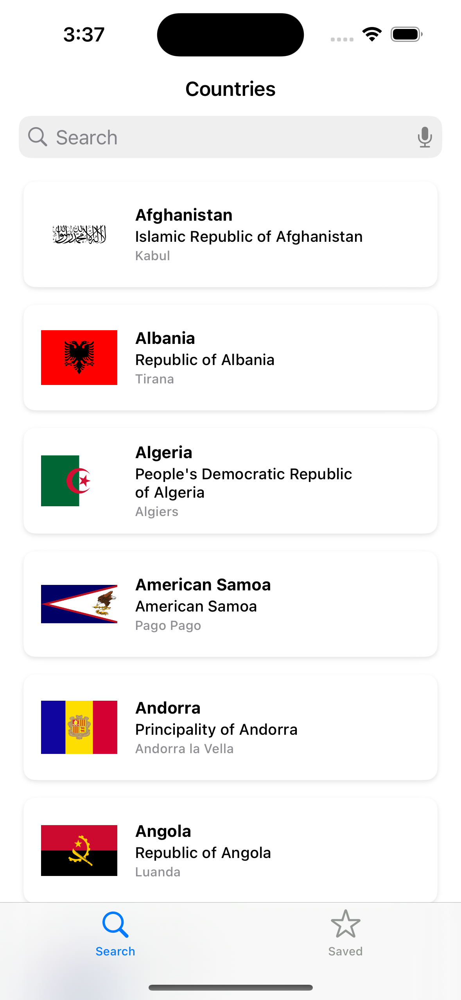
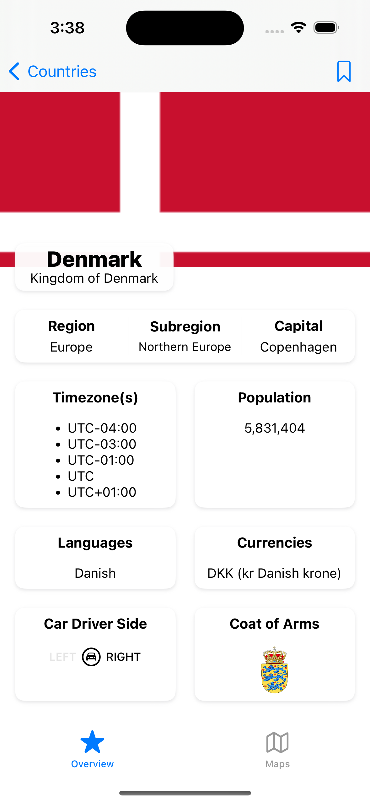
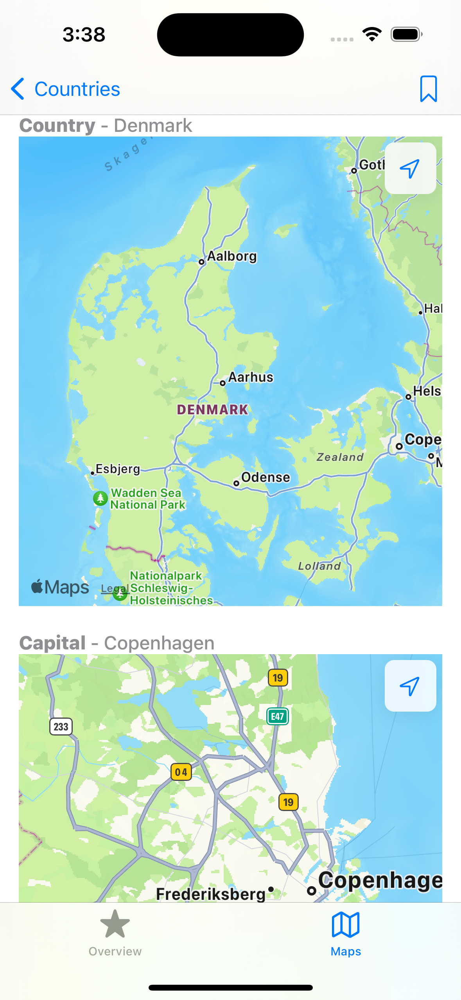

# Countries Explorer

Open-book challenge with a 15-hour time limit to write a small, focused native mobile app that provides a type-ahead search using the public [restcountries](https://restcountries.com/) API.

      

## Goals

The goal was to complete the challenge and stay up to date with the latest Swift/SwiftUI features.

## Summary of features
- List of countries in alphabetical order, custom style
- Typeahead lookup (search bar)
- Text-to-speech in the search bar
- Push to details screen upon selecting a country
- Stylized grid displaying country details, including images
- Add/remove country to favorites, persisted between app launches
- Loading transitions
- Image resize animations on scroll
- Map views showing the country, capital, and user location
- List of favorited countries

## Layers
The three key layers are the UI, API Client, and persistence. The facade pattern is used for abstraction.

### UI
The UI is implemented with SwiftUI, using the MVVM pattern.

### API Client
URLSession and Codable/Decodable protocols are used to serialize JSON from the "restcountries" RESTful API into Core Data entities. The Repository pattern is used to centralize data access.

### Persistence
Favorite countries are stored using Core Data.

## DI
Dependency Injection was implemented via property wrappers. Part of the challenge was to limit usage of 3rd party frameworks as much as possible, which rules out using something like Swinject. In addition, it was a quick way to showcase my knowledge of swift property wrappers.

## Tests
Unit tests and UI tests were implemented. A URLProtocol was used to intercept URLSession requests and test the API Client against mock json files.

## Future Improvements
These are the features that I deprioritized for the sake of completing the challenge on time.

- Cache images for improved memory usage
- Replace "magic numbers" in SwiftUI views with a style guide to support customization for landscape and different device sizes
- Localize with at least one other language
- Create a custom search bar in SwiftUI (rather than traversing the view hierarchy to find UINavigationView's search bar)

